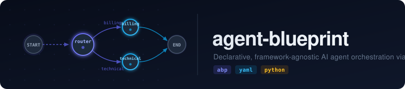

<p align="center">
  
</p>

# agent-blueprint

[](https://pypi.org/project/agent-blueprint/)
[](https://pypi.org/project/agent-blueprint/)
[](LICENSE)
[]()

**Declarative AI agent orchestration with runtime guarantees.**

`agent-blueprint` (CLI: `abp`) turns AI agent systems into versionable, testable, deployable infrastructure. You describe agents, tools, workflow graph, contracts, and policies in a single validated YAML blueprint — `abp` compiles it into a runnable [LangGraph](https://github.com/langchain-ai/langgraph) project and gives you the operational toolchain around it: linting, deterministic tests, eval suites, regression gates, sandboxed runs, OpenTelemetry export, and cloud deployment.

What makes ABP different is not less boilerplate — it is that **everything you declare is enforced at runtime**. Most agent frameworks let you *describe* guardrails; ABP *compiles them into the generated code*, so a contract in YAML and the behavior in production cannot drift apart:

| You declare | The generated runtime does |
|---|---|
| `contracts.state.invariants` | Re-checks every invariant after each agent node; violations emit a `contract_failed` trace event, then raise |
| `contracts.nodes.*.output_contract` | Validates the node's structured output against your JSON-schema-style contract |
| `policies.approvals` | Gates the listed tool calls behind human approval — `block` raises, `warn` continues but records a `policy_violation` event |
| `policies.tool_usage` | Counts and caps tool calls per node and per run; unknown tools fail instead of silently passing through |
| `policies.budgets` | Meters real token usage and provider-priced cost on every LLM call — crossing `max_tokens_per_run` / `max_cost_usd` aborts the run mid-flight; `max_latency_seconds` is verified at completion. All violations emit `policy_violation` events |
| `policies.escalation` | Reroutes the workflow to your declared review/handoff node the moment confidence drops below the threshold — mid-run, not post-hoc |
| `graph.nodes.*.retry` | Retries with backoff and emits retry trace events; exhausted retries fail deterministically |
| `harness.scenarios` | Run as deterministic tests — mocked LLM, stubbed tools, seeded — no API key, no flakiness, CI-ready |

And because every enforcement emits a structured trace event, the same declarations are **observable** (OpenTelemetry export), **testable** (`abp test` asserts on routes, state, and artifacts), and **gateable** (`abp gate` fails the PR when behavior regresses against the baseline).

If you are building a one-off demo, handwritten code is fine. If you are building agent systems that need consistency, auditability, and repeatable delivery — in CI, across a team — ABP is the stronger foundation.

```bash
pip install agent-blueprint
abp init --output my-agent.agents.yaml
abp generate my-agent.agents.yaml --target langgraph
```

---

## Table of Contents

- [How It Works](#how-it-works)
- [Installation](#installation)
- [Quick Start](#quick-start)
- [The Operational Lifecycle](#the-operational-lifecycle)
- [Blueprint Schema](#blueprint-schema)
- [CLI Reference](#cli-reference)
- [Examples](#examples)
- [Generated Project Structure](#generated-project-structure)
- [Generation Targets](#generation-targets)
- [IDE Integration](#ide-integration-vs-code)
- [Development](#development)
- [Roadmap](#roadmap)

---

## How It Works

A blueprint flows through a strict one-way compilation pipeline:

```
            ┌──────────────────┐
 YAML  ───▶ │  Pydantic models  │  schema + cross-reference validation
            └────────┬─────────┘  (escalation targets, tool refs, contract refs…)
                     ▼
            ┌──────────────────┐
            │   AgentGraph IR   │  subgraph flattening, LLM resolution,
            └────────┬─────────┘  condition expression compilation
                     ▼
            ┌──────────────────┐
            │  Code generator   │  Jinja2 templates per target
            └────────┬─────────┘
                     ▼
       runnable project:  state.py · nodes.py · graph.py · tools.py · main.py
                          + _abp_trace.py (trace manifest) · _abp_harness.py
                          + _abp_otel.py (when tracing is enabled)
```

Around the pipeline sits the operational surface — every command is a thin CLI wrapper over a reusable logic module:

| Surface | What it does |
|---|---|
| `abp lint` / `abp fix` | 9 static checks over the compiled graph (unreachable nodes, route overlap, unbounded loops, parallel branch conflicts, …); 2 are auto-fixable |
| `abp doctor` | Environment + target-compatibility diagnostics before you generate |
| `abp test` | Deterministic harness: mock/replay/live LLM modes, stub/live tools, route/state/artifact/output-contract assertions |
| `abp eval` | Dataset-driven eval suites (`exact_match`, `policy_violations`, `rubric`) |
| `abp gate` | CI merge gate: runs harness + evals, diffs against a committed baseline, exit 1 on regression |
| `abp traces` | Persisted trace records; export failures (or goldens) as eval dataset cases — the test flywheel |
| `abp run` | Generate to a temp dir and execute — optionally inside a docker/podman sandbox with an allowlist-only environment |
| `abp deploy` | Build a container and ship it to Azure Container Apps, AWS App Runner, GCP Cloud Run, or local Docker/Podman |

Condition expressions (`state.department == 'billing'`) are parsed with a safe AST-based parser — no `eval`, no arbitrary code — and the same parser powers static analysis: route-overlap detection and loop analysis in the linter.

---

## Installation

**Requirements:** Python 3.11+

```bash
pip install agent-blueprint
```

Or with `pipx` (recommended for CLI tools — keeps `abp` isolated):

```bash
pipx install agent-blueprint
```

Or from source:

```bash
git clone https://github.com/ahmetatar/agent-blueprint
cd agent-blueprint
pip install -e ".[dev]"
```

Verify:

```bash
abp --help
```

---

## Quick Start

### 1. Create a blueprint

```bash
abp init --template=blueprint --output=my-agent.agents.yaml
# or scaffold a markdown request template for Codex / Claude Code:
abp init --template=spec --output=my-agent.spec.md
```

This creates `my-agent.agents.yaml`:

```yaml
blueprint:
  name: "my-agent"
  version: "1.0"
  description: "A simple single-agent blueprint"

settings:
  default_model: "gpt-4o"
  default_temperature: 0.7

state:
  fields:
    messages:
      type: "list[message]"
      reducer: append

agents:
  assistant:
    model: "${settings.default_model}"
    system_prompt: |
      You are a helpful assistant.

graph:
  entry_point: assistant
  nodes:
    assistant:
      agent: assistant
      description: "Main assistant node"
  edges:
    - from: assistant
      to: END

memory:
  backend: in_memory
```

### 2. Validate and lint

```bash
abp validate my-agent.agents.yaml
abp lint my-agent.agents.yaml        # static analysis on the compiled graph
abp doctor my-agent.agents.yaml      # env vars set? impls importable? target compatible?
```

```
╭──────────────────── Valid — my-agent.agents.yaml ────────────────────╮
│   Blueprint      my-agent                                             │
│   Version        1.0                                                  │
│   Agents         1                                                    │
│   Tools          0                                                    │
│   Nodes          1                                                    │
│   Entry point    assistant                                            │
╰───────────────────────────────────────────────────────────────────────╯
```

### 3. Visualize the graph

```bash
abp inspect my-agent.agents.yaml
```

Outputs a [Mermaid](https://mermaid.live) diagram you can paste into any Mermaid renderer.

### 4. Generate code

```bash
abp generate my-agent.agents.yaml --target langgraph
```

```
╭────────────── Generated — my-agent (langgraph) ──────────────╮
│   my-agent-langgraph/__init__.py                              │
│   my-agent-langgraph/state.py                                 │
│   my-agent-langgraph/tools.py                                 │
│   my-agent-langgraph/nodes.py                                 │
│   my-agent-langgraph/graph.py                                 │
│   my-agent-langgraph/main.py                                  │
│   my-agent-langgraph/requirements.txt                         │
│   my-agent-langgraph/.env.example                             │
╰───────────────────────────────────────────────────────────────╯
```

### 5. Run

```bash
# the short way — generates to a temp dir and executes:
abp run my-agent.agents.yaml "Hello, how are you?"

# or work with the generated project directly:
cd my-agent-langgraph
pip install -r requirements.txt
cp .env.example .env   # add your OPENAI_API_KEY
python main.py "Hello, how are you?"
```

---

## The Operational Lifecycle

ABP's value compounds after generation. A typical blueprint lives through this loop:

```
 author ──▶ validate ──▶ lint / fix ──▶ doctor ──▶ test ──▶ eval ──▶ gate (CI)
   ▲                                                  │
   │                                                  ▼
   └──────────── traces export (failures → eval cases) ◀── run / deploy
```

1. **`abp test`** runs harness scenarios deterministically — `llm_mode: mock|replay|live`, `tool_mode: stub|replay|live` — and asserts on the final route, state, artifacts, and output contracts. Every run writes a trace manifest.
2. **`abp eval`** scores dataset-driven suites: routing accuracy, policy compliance, artifact quality rubrics.
3. **`abp gate`** is the CI merge gate: it runs both, diffs against `.abp/gate-baseline.json`, and fails on any regression. `--update-baseline` only writes when everything is green.
4. **`abp traces export`** turns failed runs into new eval cases (TDD for agents) and golden runs into locked regression tests — the dataset grows from real failures.
5. **Observability** is declarative: a top-level `observability.tracing` section exports trace events as OpenTelemetry spans to any OTLP backend. Only hashes are exported, never message content. Standard `OTEL_*` env vars override blueprint values; `ABP_OTEL=off` is the kill switch.

Deep dives: [Runtime Guarantees](docs/runtime-guarantees.md) · [Gate](docs/gate.md) · [Traces](docs/traces.md) · [Sandbox](docs/sandbox.md) · [Observability](docs/observability.md)

---

## Blueprint Schema

A blueprint YAML has these top-level sections:

| Section | Required | Description |
|---|---|---|
| `blueprint` | Yes | Name, version, description |
| `settings` | No | Default model, temperature, retries, `max_graph_steps` |
| `state` | No | Shared typed state fields flowing through the graph |
| `model_providers` | No | Provider connections — OpenAI, Anthropic, Google, Ollama, Azure, Bedrock, compatible ([details](docs/model-providers.md)) |
| `retrievers` | No | Generic RAG retriever implementations ([details](docs/rag.md)) |
| `mcp_servers` | No | MCP server connections — schema-validated; generation not implemented yet ([details](docs/mcp-servers.md)) |
| `agents` | Yes | Agent definitions: model, prompt, tools, memory, RAG, reasoning |
| `tools` | No | Tool definitions: `function`, `api`, `retrieval`, `mcp` ([details](docs/tools.md)) |
| `graph` | Yes | Nodes, edges, entry point — incl. parallel, subgraph, handoff, supervisor nodes ([details](docs/workflow-nodes.md)) |
| `subgraphs` | No | Named reusable graphs referenced by `subgraph` nodes (nesting supported) |
| `memory` | No | Checkpointing / persistence ([details](docs/memory.md)) |
| `input` / `output` | No | Input/output schemas, validated at runtime |
| `contracts` | No | State, node, and output contracts — **enforced at runtime** |
| `policies` | No | Approvals, tool limits, budgets, low-confidence escalation — **enforced at runtime** |
| `artifacts` | No | Declared artifacts (markdown/json/yaml/text) with producer + contract binding |
| `harness` | No | Deterministic scenario tests and replay fixtures |
| `evals` | No | Dataset-driven eval suites |
| `run` | No | Sandbox configuration for `abp run` ([details](docs/sandbox.md)) |
| `observability` | No | OpenTelemetry trace export ([details](docs/observability.md)) |
| `deploy` | No | Cloud deployment configuration ([details](docs/deploy.md)) |

### `blueprint`

```yaml
blueprint:
  name: "my-agent"       # Required. Used for naming generated files.
  version: "1.0"         # Optional. Default: "1.0"
  description: "..."     # Optional.
  author: "..."          # Optional.
  tags: [support, nlp]   # Optional.
```

### `settings`

```yaml
settings:
  default_model: "gpt-4o"             # Default model for all agents
  default_model_provider: openai_gpt  # Default provider (references model_providers)
  default_temperature: 0.7
  max_retries: 3
  timeout_seconds: 300
  max_graph_steps: 25                 # maps to LangGraph recursion_limit
```

> **Variable interpolation** supports two namespaces:
> - `${settings.field}` — resolved from the blueprint's `settings` section
> - `${env.VAR_NAME}` — resolved from environment variables at load time; if the variable is not set, the placeholder is kept as-is

### `state`

Defines the typed state object shared across all nodes:

```yaml
state:
  fields:
    messages:
      type: "list[message]"   # Built-in message list type
      reducer: append          # How concurrent updates merge: append | replace | merge
    department:
      type: string
      default: null
      enum: [billing, technical, general]
    resolved:
      type: boolean
      default: false
```

Reducers matter for parallel nodes: fan-out branches merge their updates through the declared reducer.

### `agents`

```yaml
agents:
  my_agent:
    name: "Friendly Name"           # Optional display name
    model: "gpt-4o"                 # or ${settings.default_model}
    model_provider: openai_gpt      # References model_providers
    system_prompt: |
      You are a helpful assistant.
    tools: [tool_a, tool_b]         # References to tools section
    temperature: 0.5
    max_tokens: 2048
    memory:
      type: conversation_buffer     # conversation_buffer | summary | vector
      max_tokens: 4000
    human_in_the_loop:
      enabled: true
      trigger: before_tool_call     # before_tool_call | after_tool_call | before_response | always
      tools: [dangerous_tool]       # Only require approval for specific tools
    llm_params:                     # Optional raw kwargs for the LangChain chat class
      timeout: 60
    reasoning:
      enabled: true                 # Mark this as a native reasoning/thinking agent
      params:                       # Raw kwargs passed through to the selected adapter
        reasoning:
          effort: high
```

> See [Model Providers](docs/model-providers.md) for adapter selection and [Reasoning Patterns](docs/reasoning.md) for native thinking and graph-level reasoning strategies.
> Structured outputs belong under top-level `contracts` and `output` — not under agents.

### `tools`

Four tool types: `function`, `api`, `retrieval`, and `mcp` (mcp: schema-only today — see [status](docs/mcp-servers.md)).

```yaml
tools:
  classify_intent:
    type: function
    impl: "myapp.classifiers.classify_intent"   # optional: wire existing code
    description: "Classify customer intent"
    parameters:
      message:
        type: string
        required: true

  lookup_invoice:
    type: api
    method: GET
    url: "https://api.example.com/invoices/{invoice_id}"
    auth:
      type: bearer
      token_env: "BILLING_API_KEY"
```

> See [Tools](docs/tools.md) for all tool types and [RAG](docs/rag.md) for retrievers and automatic context injection.

### `graph`

Defines the agent workflow as a directed graph. Six node types: `agent` (default), `function`, `handoff`, `parallel`, `subgraph`, and `supervisor`.

```yaml
graph:
  entry_point: router

  nodes:
    router:
      agent: router
      description: "Route requests"
      retry:
        max_attempts: 2
        backoff_seconds: 1
        on: [exception]
    handle_billing:
      agent: billing_agent
    escalate:
      type: handoff
      channel: slack            # console | webhook | slack | email
    fan_out_context:
      type: parallel
      branches: [research, pricing]
      join: merge_context
    triage:
      type: supervisor
      workers: [research, pricing]   # dynamic delegation via generated transfer tools
      max_iterations: 8
      on_finish: END
    prd_pipeline:
      type: subgraph
      ref: prd_generation_v1
      input_map:
        messages: messages
      output_map:
        prd: prd

  edges:
    # Simple edge
    - from: handle_billing
      to: END

    # Conditional routing
    - from: router
      to:
        - condition: "state.department == 'billing'"
          target: handle_billing
        - condition: "state.department == 'technical'"
          target: handle_technical
        - default: END
```

**Condition expressions** support: `==`, `!=`, `<`, `>`, `<=`, `>=`, `in`, `not in`, `and`, `or`, `not`. They reference state fields with `state.field_name`; arbitrary names, function calls, arithmetic, and subscripts are rejected. See [Condition Expressions](docs/condition-expressions.md).

**Parallel nodes** fan out to each branch and join at the declared `join` node — a real barrier; branch updates merge through the state reducers. **Subgraph nodes** reuse a named graph from the `subgraphs` registry with namespaced isolation (nesting supported, cycles detected at compile time). **Supervisor nodes** delegate dynamically to a declared worker set with an enforced iteration budget. **Handoff nodes** deliver to console/webhook/slack/email and emit `handoff_requested` events. See [Workflow Nodes](docs/workflow-nodes.md) for all of them.

```yaml
subgraphs:
  prd_generation_v1:
    entry_point: writer
    nodes:
      writer:
        agent: prd_writer
    edges:
      - from: writer
        to: END
```

### `contracts`

Contracts make node behavior explicit, reviewable — and enforced:

```yaml
contracts:
  state:
    required_fields: [messages]
    immutable_fields: [request_id]
    invariants:
      - "state.confidence >= 0"

  nodes:
    router:
      requires: [messages]
      produces: [route, confidence]
      output_contract: route_payload

  outputs:
    route_payload:
      type: object
      required: [route, confidence]
      properties:
        route: { type: string }
        confidence: { type: number }
```

All contract layers are enforced at runtime by the generated code: `required_fields` must be non-null at workflow completion, `invariants` are re-checked after every agent node, and violations emit `contract_failed` trace events before raising.

### `policies`

```yaml
policies:
  approvals:
    mode: selective          # or "all" to gate every tool call
    tools: [issue_refund]
    on_violation: block      # or "warn" to continue and emit policy_violation

  tool_usage:
    max_calls_per_node: 2
    max_calls_per_run: 5
    require_explicit_arguments: true
    on_unknown_tool: fail

  escalation:
    on_low_confidence: handoff_review
    confidence_threshold: 0.75

  budgets:
    max_tokens_per_run: 20000
    max_latency_seconds: 30
    max_cost_usd: 0.75
```

### `harness`

Deterministic regression checks without hitting live models:

```yaml
harness:
  defaults:
    llm_mode: mock           # mock | replay | live
    tool_mode: stub          # stub | replay | live
    seed: 42

  scenarios:
    - id: refund_happy_path
      input:
        message: "Refund invoice 123"
      expected:
        route: billing                          # node the workflow ended on (or escalated to)
        tools_called: [lookup_invoice, issue_refund]
        approvals_triggered: true
        state_assertions:                       # evaluated against the final state
          - "state.route == 'billing'"
        output_contract: refund_response        # validate stdout against contracts.outputs
        artifacts: [refund_receipt]             # artifact names that must have been written
```

All scenario assertions are executed by `abp test` — `route`, `state_assertions`, `output_contract`, and `artifacts` included. See [Runtime Guarantees](docs/runtime-guarantees.md) for real-world patterns.

### `evals`

Benchmark-style checks over datasets instead of fixed scenarios:

```yaml
evals:
  suites:
    - id: router_accuracy
      metric: exact_match
      dataset: datasets/router_cases.yaml

    - id: tool_policy_compliance
      metric: policy_violations
      dataset: datasets/policy_cases.yaml

    - id: prd_quality
      metric: rubric
      dataset: datasets/prd_cases.yaml
```

Rubric evals score generated artifacts with deterministic criteria (`min_score`, `required_sections`, `required_terms`, `min_word_count`).

### `memory`

```yaml
memory:
  backend: in_memory     # in_memory | sqlite | postgres | redis
```

> See [Memory & Checkpointing](docs/memory.md) for backends and checkpoint strategies.

### `run` and `observability`

```yaml
run:
  sandbox:
    enabled: true
    engine: auto           # auto (podman → docker) | docker | podman
    network: none
    memory: 1g
    cpus: 2
    env_passthrough: [MY_EXTRA_VAR]   # secrets are allowlisted automatically

observability:
  tracing:
    enabled: true
    exporter: otlp         # otlp | console
    protocol: http/protobuf  # or grpc
    endpoint: "http://localhost:4318"
    service_name: my-agent
    sample_ratio: 1.0
```

> Sandbox: [docs/sandbox.md](docs/sandbox.md) · Observability: [docs/observability.md](docs/observability.md)

---

## CLI Reference

| Command | Description |
|---|---|
| `abp init` | Scaffold a blueprint YAML (`--template=blueprint`) or an agent-spec markdown for Codex/Claude Code (`--template=spec`) |
| `abp validate <file>` | Validate against the schema, incl. cross-reference checks (`--quiet` for CI) |
| `abp lint <file>` | 9 static checks on the compiled graph; `abp fix` applies the auto-fixable ones |
| `abp doctor <file>` | Env + target-compatibility diagnostics (`--target langgraph\|plain\|crewai`) |
| `abp inspect <file>` | Visualize the graph as a Mermaid diagram |
| `abp generate <file>` | Generate framework code (`--target`, `--output-dir`, `--dry-run`) |
| `abp run <file> [input]` | Generate to a temp dir and run (single-shot or REPL; `--sandbox` for containers) |
| `abp test <file>` | Run deterministic harness scenarios (`--save-traces failed\|all\|none`) |
| `abp eval <file>` | Run dataset-driven eval suites (`--suite`, `--output`, `--json`) |
| `abp gate <file>` | CI merge gate: harness + evals vs. baseline; exit 1 on regression ([details](docs/gate.md)) |
| `abp traces list/export` | Inspect persisted traces; export failures/goldens as eval cases ([details](docs/traces.md)) |
| `abp deploy <file>` | Deploy to cloud (`--platform azure\|aws\|gcp\|docker\|podman`, [details](docs/deploy.md)) |
| `abp schema` | Export the blueprint JSON Schema (`--format json\|yaml`) |
| `abp github` | Open the GitHub repository |

### `abp run`

```bash
# Single-shot
abp run my-agent.yml "What is the capital of France?"

# Interactive REPL (omit input)
abp run my-agent.yml

# With options
abp run my-agent.yml --thread-id session-1 --install --env .env.local

# Inside a container (docker or podman), isolated from the host
abp run my-agent.yml "hello" --sandbox --engine podman
```

| Flag | Default | Description |
|---|---|---|
| `--target` | `langgraph` | Target framework |
| `--thread-id` | `default` | Conversation thread ID |
| `--install` | `true` | Run `pip install -r requirements.txt` before executing |
| `--env` | `.env` | Path to a `.env` file to load |
| `--sandbox / --no-sandbox` | blueprint `run.sandbox.enabled` | Run inside a container ([details](docs/sandbox.md)) |
| `--engine` | blueprint `run.sandbox.engine` | Sandbox engine: `auto` \| `docker` \| `podman` |

### `abp gate` in CI

```yaml
# .github/workflows/agents.yml (your project)
- run: abp gate my-agent.agents.yaml          # fails the PR on any regression
# after intentional changes, locally:
#   abp gate my-agent.agents.yaml --update-baseline && git add .abp/gate-baseline.json
```

---

## Examples

The `examples/` directory contains ready-to-use blueprints:

| Example | Demonstrates |
|---|---|
| [`basic-chatbot.yml`](examples/basic-chatbot.yml) | Single-agent chatbot — the simplest possible blueprint |
| [`research-team.yml`](examples/research-team.yml) | Sequential pipeline: planner → researcher → writer |
| [`incident-response.yml`](examples/incident-response.yml) | Parallel fan-out/join, subgraphs, and a Slack handoff node |
| [`prd-factory.yml`](examples/prd-factory.yml) | Artifact-driven workflow with contracts and rubric evals |

```bash
abp inspect examples/incident-response.yml
abp generate examples/incident-response.yml --target langgraph
```

> See [Reasoning Patterns](docs/reasoning.md) for advanced patterns: Chain-of-Thought, ReAct, Self-Reflection, and Extended Thinking.

---

## Generated Project Structure

For the LangGraph target:

```
my-agent-langgraph/
├── __init__.py          # Package init
├── state.py             # AgentState TypedDict with reducers
├── tools.py             # Tool functions + policy/approval enforcement
├── nodes.py             # Node functions, contract checks, escalation routing
├── graph.py             # StateGraph construction with edges and routing
├── main.py              # Entrypoint: run(user_input) → str
├── _abp_trace.py        # Trace manifest emission + observer registry
├── _abp_harness.py      # Mock/stub/replay runtime helpers
├── _abp_otel.py         # OpenTelemetry bridge (only when tracing is enabled)
├── requirements.txt     # langgraph, langchain-openai, …
└── .env.example         # Required environment variables
```

The generated code is **human-readable and fully editable**. It's a starting point, not a black box — but if you stay blueprint-first, regeneration is always safe.

---

## Generation Targets

| Target | Status | Scope |
|---|---|---|
| `langgraph` | **Production target** | Everything documented here: all node types, contracts, policies, harness, tracing |
| `plain` | Minimal | Single-node agents without tools/graph routing — a dependency-light starting point |
| `crewai` | Not implemented | `abp generate --target crewai` fails with a clear error; `abp doctor` flags it up front |

ABP's blueprint schema, IR, trace schema, and harness model are deliberately framework-agnostic — but the project's priority is **deepening runtime guarantees on the LangGraph target**, not breadth of half-supported targets. A new target is added when it can implement the same trace and harness semantics, so blueprints and their test suites stay portable. If you want to build one, see [Adding a new target framework](#adding-a-new-target-framework).

---

## IDE Integration (VS Code)

Export the JSON Schema and configure the YAML extension for autocompletion and inline validation:

```bash
abp schema --output blueprint-schema.json
```

Add to `.vscode/settings.json`:

```json
{
  "yaml.schemas": {
    "./blueprint-schema.json": "*.agents.yaml"
  }
}
```

---

## Development

```bash
git clone https://github.com/ahmetatar/agent-blueprint
cd agent-blueprint
pip install -e ".[dev]"
pre-commit install
pre-commit install --hook-type commit-msg

pytest                # full test suite
ruff check .          # lint
mypy src              # strict type check
```

See [CONTRIBUTING.md](CONTRIBUTING.md) for contribution rules, Conventional Commits, PR expectations, and testing requirements. For maintainers, [Releasing](docs/releasing.md) covers version bump, tagging, and PyPI publishing.

### Project Structure

```
src/agent_blueprint/
├── models/         # Pydantic v2 schema models (validation + cross-references)
├── ir/             # Intermediate representation: compiler + safe expression parser
├── generators/     # Code generators (langgraph; plain minimal)
├── templates/      # Jinja2 templates per target framework
├── cli/            # Typer CLI commands (thin wrappers)
├── linting.py      # Static checks over the compiled graph
├── doctoring.py    # Env + target-compatibility diagnostics
├── harness_runner.py / eval_runner.py / gating.py / trace_store.py
├── runners/        # abp run: local + container sandbox
├── deployers/      # Azure, AWS, GCP, Docker/Podman
└── utils/          # YAML loader (${} interpolation), Mermaid visualizer
```

### Adding a new target framework

1. Create `src/agent_blueprint/generators/<framework>.py` implementing `BaseGenerator`
2. Add Jinja2 templates to `src/agent_blueprint/templates/<framework>/`
3. Register in `src/agent_blueprint/cli/generate.py`

The `AgentGraph` IR in `src/agent_blueprint/ir/compiler.py` is the single input to all generators — you don't touch the parser or validator. A target is considered complete when it implements the ABP trace and harness semantics, so existing harness scenarios run against it unchanged.

---

## Roadmap

Done — and enforced at runtime, not just declared:

- [x] Schema validation, `${}` interpolation, safe condition expressions
- [x] LangGraph generator: all 6 node types incl. parallel, nested subgraphs, handoff, supervisor
- [x] Runtime-enforced contracts, approval policies, budgets, retries, escalation
- [x] Deterministic harness (`abp test`) with mock/replay/live modes + full assertion surface
- [x] Eval suites, CI regression gate, trace→eval flywheel
- [x] Sandboxed runs (docker/podman), OpenTelemetry export
- [x] Cloud deploy: Azure Container Apps, AWS App Runner, GCP Cloud Run, Docker/Podman
- [x] PyPI publish (`pip install agent-blueprint`)

Next:

- [ ] MCP tool code generation (schema + validation already in place)
- [ ] Deeper plain-Python target or an additional framework target — gated on demand and on full trace/harness parity
- [ ] VS Code extension

---

## License

MIT
